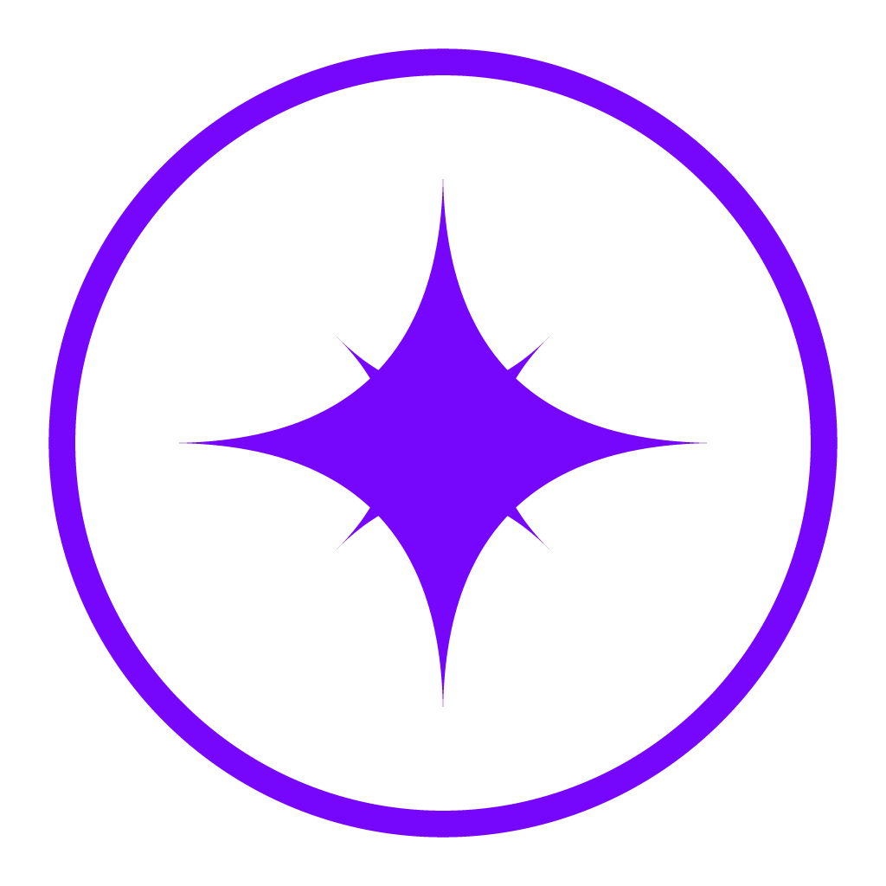
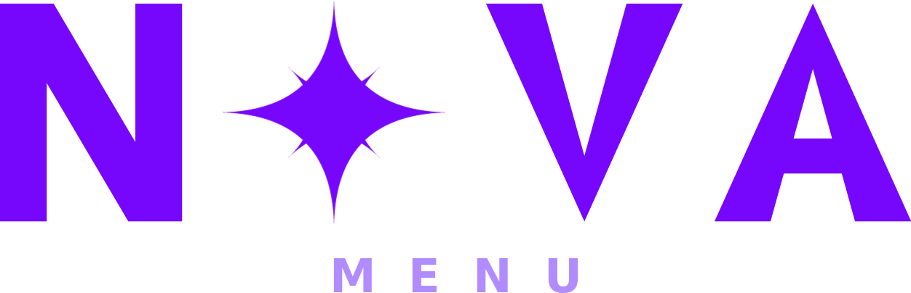

  

---

	
	
	

---

# Nova Menu  
Maintained by [HZMGTX](https://github.com/HZMGTX). Built on [Poison Menu](https://github.com/heycanihavethis/Poison) (formerly Seralyth Menu), itself forked from ii's Stupid Menu.

Nova Menu is a **feature-packed** mod menu for Gorilla Tag, built by the community, for the community. Whether you just want mods, are a developer, or anything inbetween, this menu has you covered. Designed to be **as useful as possible**, it includes a variety of features and options that let you customize your modding experience to your heart’s content.  

  
<b>💡 Why open-source?</b>

	
Great question. The modding community used to be about **sharing, learning, and improving** together. But nowadays, everything’s locked behind **paywalls and obfuscation**. That’s not how it should be.  

By making this menu open-source, I'm giving **everyone** the opportunity to:  
- Learn how mod menus work 
- Experiment with new ideas  
- Contribute to the Gorilla Tag modding scene  
- ⭐ **Keep modding free and accessible**  

Let's bring back the collaboration of modding. No paywalls, no secrets, no malware, just good mods.  

  
<b>❓ Can I use your code?</b>

	
**Of course!** But there’s a catch: you gotta play fair. **[GPL-3.0 License](https://www.gnu.org/licenses/gpl-3.0.html) rules apply**, which means that if you use my code:  
- Your project **must** also be open-source.  
- Give credit where it's due.
- No shady stuff.
- **[Follow the license.](https://www.gnu.org/licenses/gpl-3.0.html)**

  
<b>💾 Installation</b>

	
1. **Download** the latest release **[here](https://github.com/HZMGTX/Nova/releases/latest)**
2. **Drag & Drop** `Nova Menu.dll` into your plugins folder  
3. **Launch** Gorilla Tag and enjoy!

**🧱 From Source Code (for developers!)**

1. Download the source code **[here](https://github.com/HZMGTX/Nova/releases/latest)**
2. Edit `Directory.Build.props` and update `<GamePath>` if your Gorilla Tag is in a custom spot
3. Build the project with `Ctrl + Shift + B` 
✅ The DLL will automatically go into your Gorilla Tag plugins folder

---

  
<b>🎛️ System Compatibility</b>

	
| Operating System | Menu | Fonts | Images | Sounds | Videos |
|------------------|------|--------|--------|--------|--------|
| Windows 10|✅|✅|✅|✅|✅|
| Windows 11|✅|✅|✅|✅|✅|
| Mac OS|✅|✅|✅|✅|❌|
| Linux|✅|✅|✅|✅|❌|

> ✅ Works as intended ; ⚠️ Semi functional ; ❌ Does not work ; ❓ Untested

  
<b>🔗 Headset Compatibility</b>

	
| Headset | Menu | Mods |
|---------|------|------|
|Rift|✅|✅|
|Rift S|✅|✅|
|Oculus Go|⚠️|❌|
|Quest 1|✅|✅|
|Quest 2|✅|✅|
|Quest Pro|✅|✅|
|Quest 3/3s|✅|✅|
|Pico 4/Pro|✅|✅|
|Pico 4 Ultra Pro|✅|⚠️|
|Valve Index|✅|✅|
|HTC VIVE/Pro|✅|⚠️|
|HP Reverb G1/G2|✅|⚠️|

> ✅ Fully functional ; ⚠️ Limited functionality ; ❌ Not functionable ; ❓ Untested

  
<b>🗣️ Contact Information</b>

	
Join our [Discord](https://discord.gg/EFTCVQe8Gx)!

  
<b>💖 Support</b>

	
If you wish to support us, here are some of the ways you can!

Donation links have not been set up yet. *(Maintainer: add your own here.)*

> [!NOTE] 
> This product is not affiliated with Gorilla Tag or Another Axiom LLC and is not endorsed or otherwise sponsored by Another Axiom LLC. Portions of the materials contained herein are property of Another Axiom LLC. © 2026 Another Axiom LLC. 
> Menu sends requests to https://www.menu.management for telemetry, administrative, friend and TTS (text to speech) purposes. 
> Menu sends requests to https://text.pollinations.ai for the mod **AI Assistant**. (when enabled) 
> Menu sends requests to https://lazypy.ro for many TTS voices. 
> Menu connects to wss://vbvbekoikimuvhqfzolt.supabase.co (the menu.management relay) for friend system and administrative purposes. 
> Menu downloads Console assets from https://github.com/HZMGTX/Console. 
> Questions about how this data is used go to [GitHub issues](https://github.com/HZMGTX/Nova/issues). 
> The donate, search, star and speak symbols are provided from [Icons8](https://icons8.com).

> Nova Menu  README.md 
> A community driven mod menu for Gorilla Tag with over 1000+ mods
>
> Copyright (C) 2026  Poison Software
> Copyright (C) 2026  HZMGTX
> https://github.com/HZMGTX/Nova
>
> Modified from Poison Menu (formerly Seralyth Menu)
> https://github.com/heycanihavethis/Poison
> 
> This program is free software: you can redistribute it and/or modify
> it under the terms of the GNU General Public License as published by
> the Free Software Foundation, either version 3 of the License, or
> (at your option) any later version.
> 
> This program is distributed in the hope that it will be useful,
> but WITHOUT ANY WARRANTY; without even the implied warranty of
> MERCHANTABILITY or FITNESS FOR A PARTICULAR PURPOSE.  See the
> GNU General Public License for more details.
> 
> You should have received a copy of the GNU General Public License
> along with this program.  If not, see <https://www.gnu.org/licenses>.

> This product is not affiliated with Another Axiom Inc. or its videogames Gorilla Tag and Orion Drift and is not endorsed or otherwise sponsored by Another Axiom. Portions of the materials contained herein are property of Another Axiom. ©2021 Another Axiom Inc.

> The names "Poison", "Poison Software", "Seralyth" and "Seralyth Software", and their logos, artwork and branding, belong to their owners, are not covered by this license, and are not used by Nova. Nova's own artwork is in `Resources/GitHub` and `Resources/Client/icon.png`.
